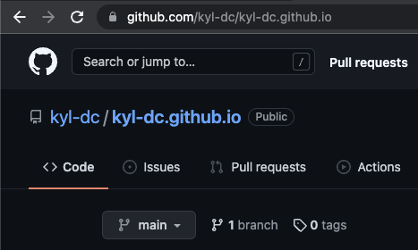
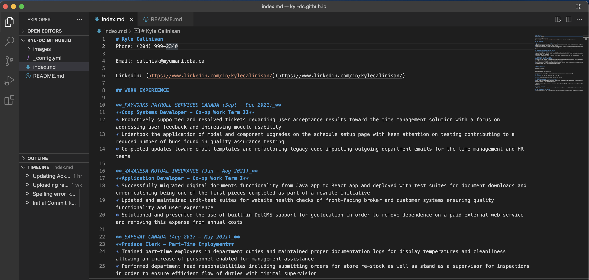
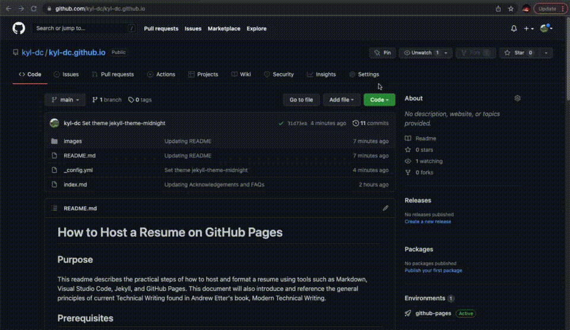
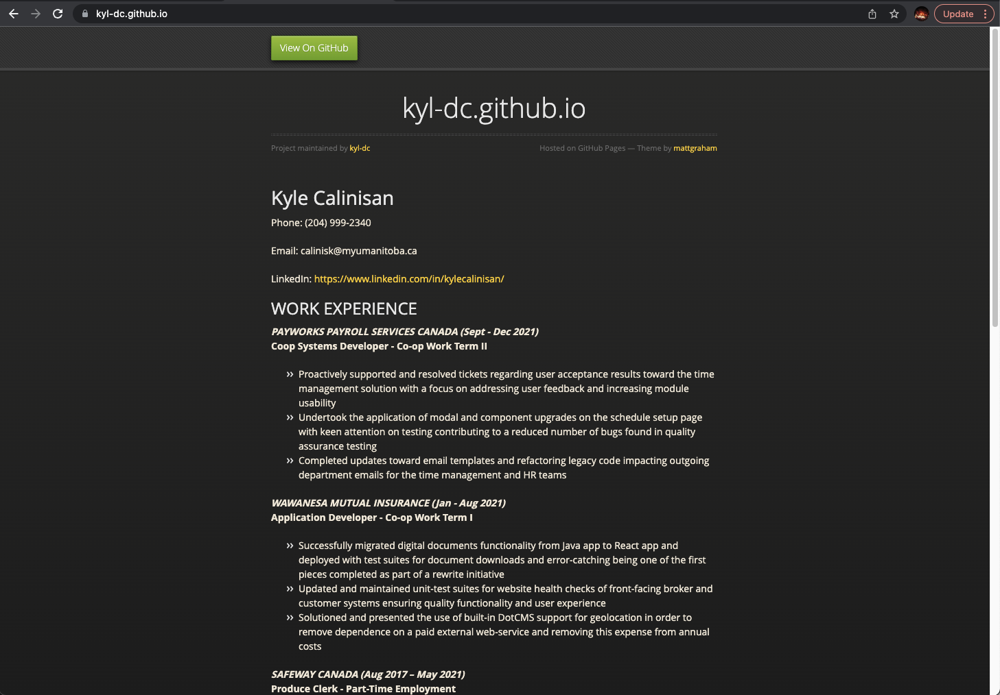

# How to Host a Resume on GitHub Pages

## Purpose

This readme describes the practical steps of how to host and format a resume using tools such as Markdown, Visual Studio Code, Jekyll, and GitHub Pages. This document will also introduce and reference the general principles of current Technical Writing found in Andrew Etter's book, Modern Technical Writing.

## Prerequisites

#### Your Resume in Markdown
* To host a resume page, you will need your resume to be formatted in Markdown. As the resume will be hosted using GitHub Pages, using GitHub Flavored Markdown would work best.
* Here's a link to learn [GitHub Flavored Markdown.](https://docs.github.com/en/get-started/writing-on-github/getting-started-with-writing-and-formatting-on-github/basic-writing-and-formatting-syntax)

#### A Markdown Editor
* You will need a Markdown Editor to make your changes and write your Markdown-formatted resume. The Markdown Editor used in this tutorial was Visual Studio Code.
* Here's a link to download [VSCode.](https://code.visualstudio.com/download)

#### A GitHub Account
* The resume will be hosted on GitHub Pages and thus you will need a GitHub account.
* Here's a link to join [GitHub.](https://github.com/join)

## Instructions

> _**"Use a Distributed Version Control"**_ (Etter, 2016, p. 23)
Etter suggests the use of version control systems as most developers prefer them for collaborative contributions. With tools such as GitHub, documentation and code alike can be more easily managed and synced with future modifications.
For this project, GitHub not only allows us to use its version control system but also hosts our resume through GitHub Pages.
1. Create a new repository for your resume
    * Your repository name should follow this format: __\<username\>.github.io__
    * This will allow GitHub to recognize that your repository will be used for your static website with the URL __https://\<username\>.github.io/__

Here's what your repository should look like:

2. Copy the URL of your new repository

3. Open up Visual Studio Code

4. Clone your new repository
    * Use the URL of your new repository that you copied earlier!

> _**"Use Lightweight Markup"**_ (Etter, 2016, p.18)
One of the main reasons that Etter suggests the use of lightweight markups is for its simplicity. Utilizing a lightweight markup language reduces the obstacle of spending time on learning while increasing any potential technical writer's ability to contribute to projects.
Using Markdown allows us to easily produce well-formatted files and build our static website using your Markdown-formatted resume.
See: [Why is Markdown better than a word processor?](#faqs-frequently-asked-questions)

5. Create an `index.md` file
    * This will hold your Markdown formatted resume

6. Create a `README.md` file
    * A standard file for any documentation about your page

7. Create a `_config.yml` file
    * This file will your page's configuration settings such as the Jekyll theme for your resume

Here's what it would look like in Visual Studio Code with all of your files:

8. Commit your changes locally

9. Push your new resume on to GitHub

10. Go to your repository on GitHub
    * Your 3 files should now be visible on your GitHub repository online

> _**"Make Static Websites"**_ (Etter, 2016, p.25)
Etter describes static websites as simple, portable, and secure. Static websites only need to serve pages and generators such as GitHub Pages do the rest.
Your resume will be hosted using GitHub Pages with a supported Jekyll theme also provided by them.

11. Go to your repository's Settings tab

12. Navigate to the Pages tab under Code and Automation
    * Under Source, you should have Branch: main / root or Branch: master / root

14. Click Save under the Source section

15. View your static website at __https://\<username\>.github.io/__

15. Navigate back to the Pages tab

16. Click the Change theme button under the Theme Chooser section 

17. Choose the desired theme for your resume

18. Click Select theme

Here's a quick walkthrough of steps 11-18:

19. View your _themed_ static website at __https://\<username\>.github.io/__
    * See: [Why is my selected theme not rendering?](#faqs-frequently-asked-questions)

20. Congratulations! You've hosted your own resume on GitHub Pages!

Here's an example of the end result:

## More Resources
* [Markdown Tutorial by CommonMark](https://commonmark.org/help/tutorial/)
* [GitHub Flavored Markdown](https://docs.github.com/en/get-started/writing-on-github/getting-started-with-writing-and-formatting-on-github/basic-writing-and-formatting-syntax)
* [GitHub Pages supported Themes](https://pages.github.com/themes/)
* [Modern Technical Writing by Andrew Etter](https://www.amazon.ca/Modern-Technical-Writing-Introduction-Documentation-ebook/dp/B01A2QL9SS)

## Authors and Acknowledgements

* **Kyle Calinisan** - _Project Author_ - [kyl-dc](https://github.com/kyl-dc) 
* **Andrew Etter** - _Author of Modern Technical Writing_ - [Modern Technical Writing](https://www.amazon.ca/Modern-Technical-Writing-Introduction-Documentation-ebook/dp/B01A2QL9SS)
* **Billie Thompson** - _Provided README Template_ - [PurpleBooth](https://github.com/PurpleBooth)
* **Scott Jodoin** - _Group Member and Editor_ - [scottjodoin](https://github.com/scottjodoin)
* **Tahmidul Hasnain Zidaan** - _Group Member and Editor_ - [thzidaan](https://github.com/thzidaan)
* **Raven Carencia** - _Group Member and Editor_ - [Leiven](https://github.com/Leiven/Leiven.github.io)
* **Hao Qin** - _Group Member and Editor_ - [qinh3uofm](https://github.com/qinh3uofm)

## FAQs (Frequently Asked Questions)
**1. Why is Markdown better than a word processor?**

Markdown is the most widely used lightweight markup language. (Etter, 2016) Compared to a word processor, Markdown is simply a plain text formatting syntax that makes it much easier to use. Additionally, the simplicity of Markdown makes it easier to learn without having several other buttons and functions for formatting like a word processor.

**2. Why is my selected theme not rendering?**

It may take around 5-10 minutes for your theme to render onto your resume. After changing the theme, you may view the GitHub Pages workflow under the Actions tab to see the changes being deployed onto your static website. If you are still unable to see the theme on your resume, try refreshing and deleting your browser cache. 
